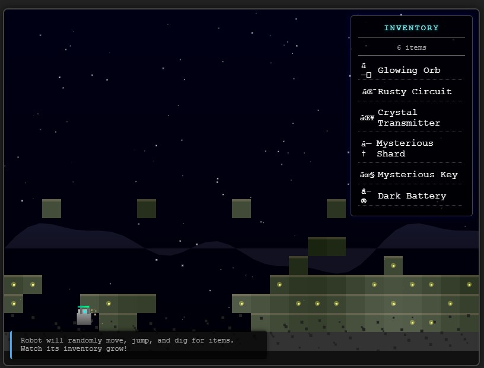

# Blipp Robot Game

A game featuring a robot that explores, digs, and collects items in a procedurally generated world.

## Overview
This project is based on the original robot platformer game, which has been preserved in the `blipp.html` file and as a backup in the static directory.

## Project Structure
The project has been modularized for better code organization and maintainability:
- `index.html` - Main entry point for the modularized version
- `css/styles.css` - Extracted CSS styles
- `js/` - Contains modularized JavaScript components:
  - `main.js` - Game initialization and main loop
  - `world.js` - World generation and management
  - `robot.js` - Robot entity with physics, AI, and collision detection
  - `inventory.js` - Inventory system with item generation
  - `renderer.js` - Graphics rendering system
  - `database.js` - Communication with the database server
- `game_db.py` - Flask API server for game data tracking
- `start_db_server.bat` - Script to start the database server
- `blipp.html` - Original monolithic version (preserved for reference)
- `backup/` - Contains backups of previous versions

## Getting Started
- Clone this repository: `git clone https://github.com/Melthizar/blipp.git`
- Open `index.html` in a web browser to play the modular version
- Open `blipp.html` to play the original version

### Database Integration (Optional)
- Install required Python packages: `pip install flask flask-cors`
- Run `start_db_server.bat` or execute `python game_db.py` to start the database server
- The game will automatically connect to the database if the server is running
- Access the dashboard at http://localhost:5000/api/dashboard or click the 'Open Dashboard' button in-game

## Features
- Procedurally generated world
- Robot with AI behavior for movement and digging
- Inventory system for collected items
- Infinite world generation with scrolling
- Jetpack system with energy management and visual effects
  - Energy bar display
  - Particle effects for jetpack flames
  - AI-controlled usage
- Database integration for game data tracking
  - Tracks robot state and inventory items
  - Provides a real-time dashboard for statistics
  - Stores collected items with their properties

## License
This project is licensed under the MIT License - see the LICENSE file for details.

## Contributing
Contributions are welcome! Feel free to submit a Pull Request.
